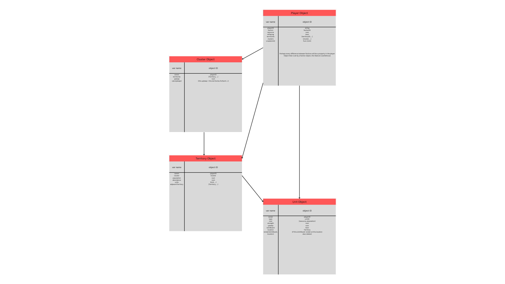
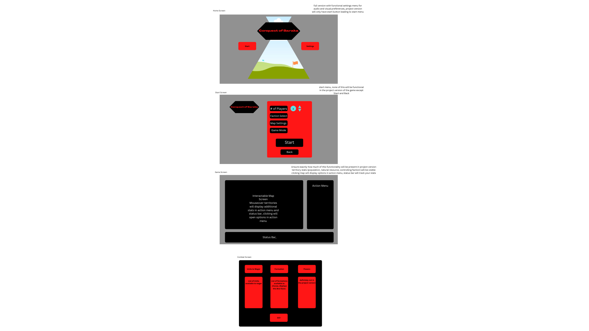

OVERVIEW

PLEASE NOTE - [Bracketed text] describes the advanced, super ambitious version only.
--
This application will be a 2 [to 4] player turn-based strategy game of territory control where players muster, maneuver, and wager their units in pursuit of conquest. This game builds on Risk with multiple unit types [belonging to unique factions with special powers], combat formations represented by an intransient series of dice, and land with dynamic stats [as well as random map generation, unit clusters requiring an upkeep cost, and seasonal effects]. I've had this idea for a while and this will be my first serious attempt at building it.

Technologies used:
HTML5
CSS
Javascript

USER STORIES
--

-The user is a god sending their Priests to an inhabited island to gain followers and crush the opposing deities.
-[A user will be able to choose how many players they want to play with.]
-[A user will be able to generate a random map of dynamic territory.]
-A user will be able to see the territories and their respective stats from which to choose their starting locations similarly to Settlers of Catan style placement. They will then place their starting Priest units in their chosen locations.
-A user will select from a menu of 4 [or more] possible commands that his units can carry out that turn. [Each command is selected before a turn starts and has a "speed" so that, each turn, commands are executed in the order of their speed.]
-A user's number of actions is limited to the number of their Priests.
-A user will have his Priests raise Soldiers or more Priests [or more powerful entities] from the local population of Peasant units, consuming resources and population.
-A user will have his Priests command Peasants to sow the land, increasing its stats.
-A user will have his Priests extract the resources of the land, decreasing its stats.
-A user will have his Soldiers march on unclaimed and enemy territories.
-[A user will have multiple Priests combine their commands for more powerful actions.]
-Users will be able to engage the enemy using their marching command, initiating combat.
-During combat, users will wager a number of units in the contested territory and choose a combat formation. [If any of the units they wagered have combat powers, they will choose if and how to activate them.]
-The users will win combat based on the power of their wager and their skill in choosing a formation dice, a non-transitive series like rock paper scissors, to roll for a bonus [plus any bonuses from powers and/or seasons].
-The user will win the game when they have eliminated their enemies [or met another victory condition].
-A user may concede at any time [and all their units will tranform into peasants].

WORK WEEK SCHEDULE
--

Monday: Get basic entity objects programmed and talking to each other.
Tuesday: Finish HTML structure for map, action menue, status, hook up to objects.
Wednesday: Functions!
Thursday: Game loop!
Friday: Style!

